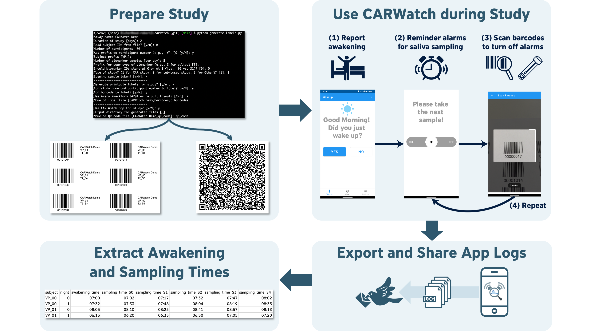

# CARWatch Web

**Get the Android app on the Play Store:**  
[](https://play.google.com/store/apps/details?id=de.fau.cs.mad.carwatch)

CARWatch is an open-source framework to support **objective** and **low-cost** assessment of cortisol samples in real-world, unsupervised environments. It is especially suitable for **cortisol awakening response (CAR)** research, but not limited to this application.

It consists of an [Android application](https://github.com/mad-lab-fau/carwatch-app) that schedules sampling times and tracks
them by scanning a barcode on the respective sampling tube as well as a [web app](https://mad-lab-fau.github.io/carwatch-web/) that provides tools to 
**configure studies** and **prepare the study materials** and to **process the log data** recorded by the app.
Alternatively, users with programming experience can use the corresponding [Python package](https://github.com/mad-lab-fau/carwatch-python/) that provides the same range of functionality.

## Features

In order to use CARWatch, you need to prepare the study materials and configure the app. The whole workflow is
illustrated in the following figure:



All these features are provided by `carwatch-web`: 
1. **Setting up a CAR study.**   
This includes: 
   * Customizing study properties to your needs
   * Setting up your desired sampling schedule
   * Generating a QR-Code for the [CARWatch app](https://github.com/mad-lab-fau/carwatch-app) to automatically set up 
   the study in the app

2. **Creating printable labels with barcodes for objective sampling time assessment.**  
This includes:
   * Customizing the numer of saliva samples per day, the number of days, and the number of study participants
   * Adding an optional evening saliva sample
   * Customize barcodes to fit your printable label templates

3. **Analyzing the CARWatch log data.**  
This includes:
   * Extracting the sampling timestamps from the log data
   * Extracting the self-reported awakening times (if available)

## Usage

Simply visit the [CARWatch Website](https://mad-lab-fau.github.io/carwatch-web/) and follow the instructions to get started. It works for all common modern browsers. In particular, it has been extensively tested for Chrome and Firefox. All calculations are performed locally in your browser and no data is sent to a server. Thus, we are not collecting any data from you.

## Developer Guide

`carwatch-web` is a web app based on the [SvelteKit](https://kit.svelte.dev/) framework. It is written in TypeScript and uses [Tailwind CSS](https://tailwindcss.com/) and [Skeleton](https://www.skeleton.dev/) for styling.
If you are a developer and want to contribute to `carwatch` you can install an editable version of the package from 
a local copy of the repository.

### Installation

To run `carwatch-web` locally, first clone the repository:

```bash
git clone https://github.com/mad-lab-fau/carwatch-web.git
cd your/path/to/carwatch-web
```

Then, install the dependencies:

```bash
npm install
```

Finally, start the development server:

```bash
npm run dev

# or start the server and open the app in a new browser tab
npm run dev -- --open
```

### Building

To create a production version of `carwatch-web` locally, run:

```bash
npm run build
```

You can preview the production build with `npm run preview`.

### Deploying

`carwatch-web` uses a static adapter and is thus completely client-site rendered. It is hosted on GitHub Pages and deployed automatically on every push to the `main` branch.

## License

This project is licensed under the MIT License. See the LICENSE file for details.


## Citing carwatch

If you use `carwatch-web` in your work, please report the version you used in the text. Additionally, please also cite [our paper](https://www.sciencedirect.com/science/article/abs/pii/S0306453023000513?via%3Dihub) published in Psychoneuroendocrinology:

```
Richer, R., Abel, L., Küderle, A., Eskofier, B. M., & Rohleder, N. (2023). CARWatch – A smartphone application for 
improving the accuracy of cortisol awakening response sampling. Psychoneuroendocrinology, 151, 106073. 
https://doi.org/10.1016/j.psyneuen.2023.106073
```

## Contact

If you have any questions or feedback about CARWatch, please contact
[Robert Richer](mailto:robert.richer@fau.de).
